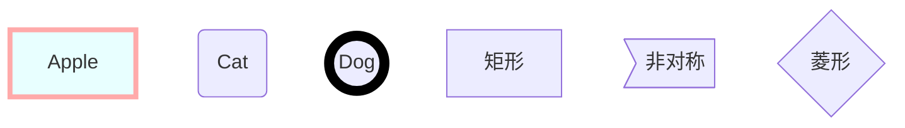

例子：
```mermaid
	graph TB
	A[Apple]-->B{Boy}
	A---C(Cat)
	B.->D((Dog))
	C==喵==>D
	style A fill:#2ff,fill-opacity:0.1,stroke:#faa,stroke-width:4px
	style D stroke:#000,stroke-width:8px;
```

----
TB/TD（ top bottom/top down）表示从上到下
BT（bottom top）表示从下到上
RL（right left）表示从右到左
LR（left right）表示从左到右

### 节点类型
   节点本身的展现形式，是通过不同括号来代表各自不同的形状，默认为矩形。

默认节点： A
矩形节点： B[矩形]
圆角矩形节点： C(圆角矩形)
圆形节点： D((圆形))
非对称节点： E>非对称]
菱形节点： F{菱形}



## 语法详解
节点连线
   线条本身的形式有多种，通过常规的英文格式的格式来标识，具体如下：

箭头连接 A1- ->B1
开放连接 A2- - -B2
虚线箭头连接 A3.->B3 或者 A3-.->B3
虚线连接 A4.-B4 或者 A4-.-B4
粗线箭头连接 A5==>B5
粗线开放连接 A6===B6
标签虚线箭头连接 A7-.text.->B7
标签开放连接 A8- -text- - -B8


##节点样式
   样式写法跟矢量图（SVG）中CSS的写法一致，含有的属性有：
```
style 节点  样式

```
