[](https://blog.csdn.net/skytruine/article/details/105828748)

----

[toc]

---


# 1引言
Markdown是轻量级的标记语言，绘制思维导图不是Markdown的工作而是Markdown解析器（引擎）的工作。


2 Markdown: Mermaid绘制思维导图

> Mermaid是一个用于画流程图、状态图、时序图、甘特图的库，使用 JS 进行本地渲染，广泛集成于许多 Markdown 编辑器中。–[《Mermaid 实用教程》](https://blog.csdn.net/fenghuizhidao/article/details/79440583)
>
> 虽然Mermaid本身暂未支持思维导图的绘制，但是考虑到Mermaid对流程图的支持，可以用Mermaid绘制极简单的思维导图。在CSDN环境下，以下给出横向和纵向两种基础思维导图的实现样例。Merimaid的具体语法可以参照[官方文档](https://mermaidjs.github.io/#/flowchart?id=graph)。


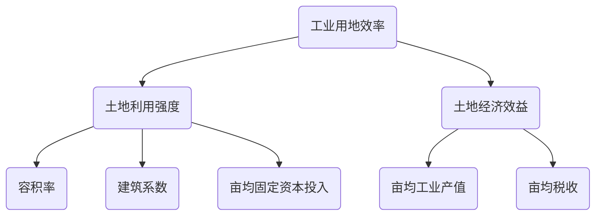


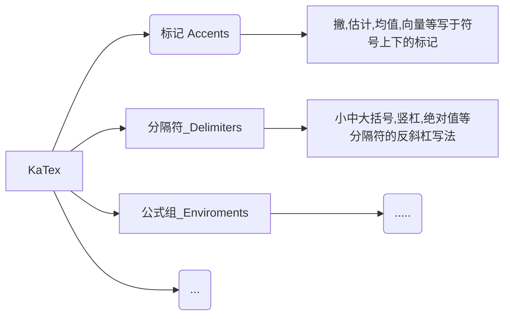


 


----
https://blog.csdn.net/fenghuizhidao/article/details/79440583

# Mermaid 实用教程

Mermaid 是一个用于画流程图、状态图、时序图、甘特图的库，使用 JS 进行本地渲染，广泛集成于许多 Markdown 编辑器中。

之前用过 PlantUML，但是发现这个东西的实现原理是生成 UML 的图片后上传服务端，每次再从服务端读取，因此觉得不够鲁棒，隐私性也不好，因而弃用。

Mermaid 作为一个使用 JS 渲染的库，生成的不是一个“图片”，而是一段 HTML 代码，因此安全许多。

官网：https://mermaidjs.github.io/
Github 项目地址：https://github.com/knsv/mermaid

接下来介绍 Mermaid 的流程图及序列图的语法，也就是大家在工作中常使用的图表。

## 流程图
### 图表方向
Mermaid 支持多种图表的方向，语法如下： 
```
graph 方向描述
    图表中的其他语句...

```

其中“方向描述”为

| 用词   | 含义     | 
| -------- | -------- |  
|TB  | 从上到下 |  
| BT | 从下到上 |  
| RL | 从右到左 |  
| LR |  从左到右 |  
|  |  |  


### 节点定义
即流程图中每个文本块，包括开始、结束、处理、判断等。Mermaid 中每个节点都有一个 id，以及节点的文字。

| 表述   | 含义     | 
| -------- | -------- |  
|id[文字]  | 矩形节点 |  
|id(文字)  | 圆角矩形节点 |  
|id((文字))  | 圆形节点  |  
| id>文字] | 右向旗帜状节点 |  
|id{文字}  | 菱形节点 |  
|  |  |  
|  |  |  
|  |  |  


需要注意的是，如果节点的文字中包含标点符号，需要时用双引号包裹起来。
另外如果希望在文字中使用换行，请使用
替换换行

### 节点间的连线

| 表述   | 含义     | 
| -------- | -------- |  
| > | 添加尾部箭头 |  
| - | 不添加尾部箭头 |  
|--  | 单线 |  
|--text--  | 单线上加文字 |  
| == |  粗线 |  
| ==text== |  粗线加文字|  
|-.-  | 虚线 |  
| -.text.- |  虚线加文字 |  
|  |  |  


子图表
使用以下语法添加子图表

```
subgraph 子图表名称
    子图表中的描述语句...
end

```

### 对 fontawesome 的支持
使用 fa: #图表名称# 的语法添加 fontawesome。

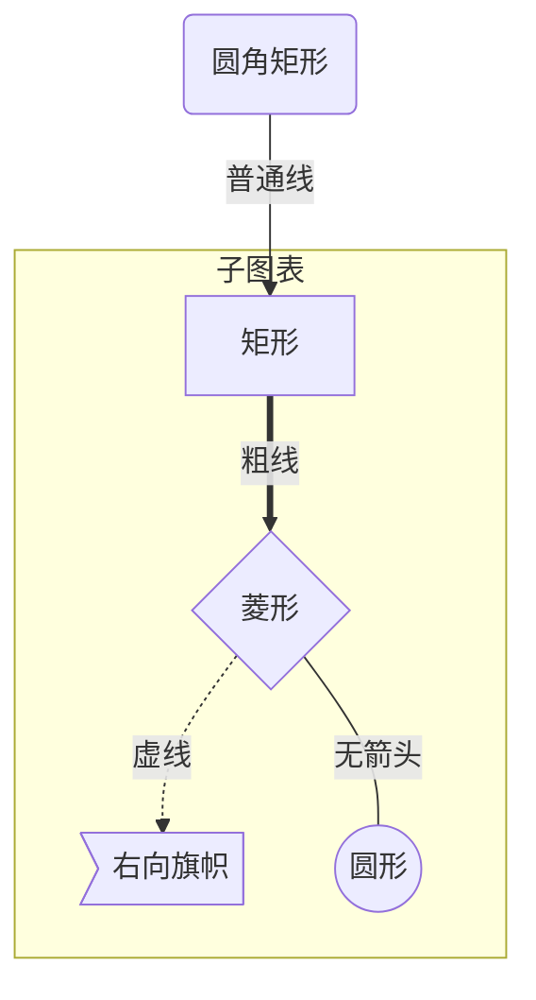


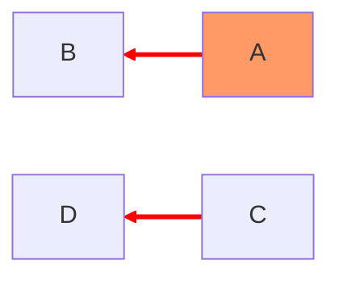


<style>
#L-C-D .arrowheadPath {
        fill:red !important;
}
</style>

### 序列图
使用以下语法开始序列图
```
sequenceDiagram
    [参与者1][消息线][参与者2]:消息体

```

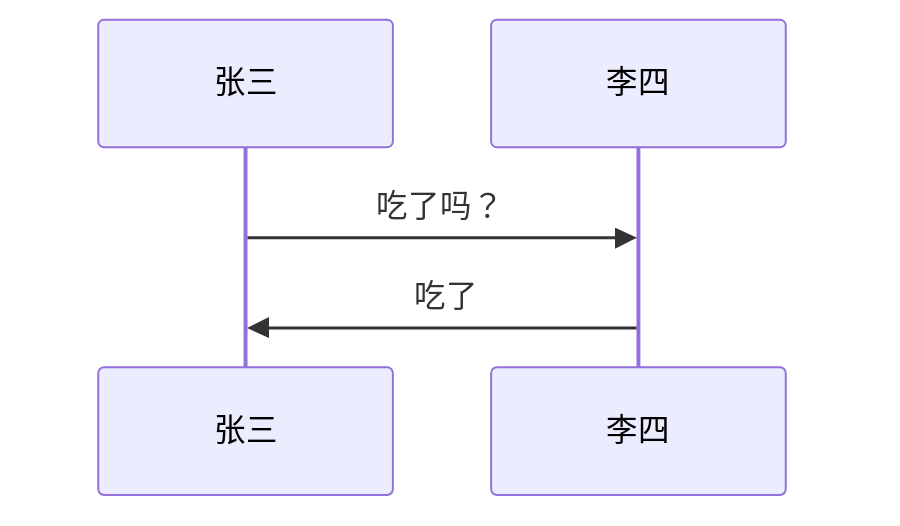

参与者
上例中的张三、李四都是参与者，上例中的语法是最简单的，也可以明显表明参与者有哪些

```
sequenceDiagram
    participant 参与者 1
    participant 参与者 2
    ...
    participant 简称 as 参与者 3 #该语法可以在接下来的描述中使用简称来代替参与者 3
```


#### 消息线
|类型|描述|
|->|无箭头的实线|
|-->|无箭头的虚线|
|->>|有箭头的实线|
|-->>|有箭头的虚线|
|-x|末端为叉的实线（表示异步）|
|--x|末端为叉的虚线（表示异步）|

#### 处理中
在消息线末尾增加 + ，则消息接收者进入当前消息的“处理中”状态；
在消息线末尾增加 - ，则消息接收者离开当前消息的“处理中”状态。

或者使用以下语法直接说明某个参与者进入“处理中”状态

```
activate 参与者
```

#### 标注
语法如下
```
Note 位置表述 参与者: 标注文字
```

其中位置表述可以为

| 表述   | 含义     | 
| -------- | -------- |  
| right of | 右侧 |  
|left of  | 左侧 |  
| over |  在当中，可以横跨多个参与者 |  
|  |  |  
|  |  |  
|  |  |  
|  |  |  
|  |  |  
|  |  |  


#### 循环
语法如下

```
loop 循环的条件
    循环体描述语句
end
```

#### 判断
```
alt 条件 1 描述
    分支 1 描述语句
else 条件 2 描述 # else 分支可选
    分支 2 描述语句
else ...
    ...
end
```

如果遇到可选的情况，即没有 else 分支的情况，使用如下语法：

```
opt 条件描述
    分支描述语句
end

```

#### 举个例子

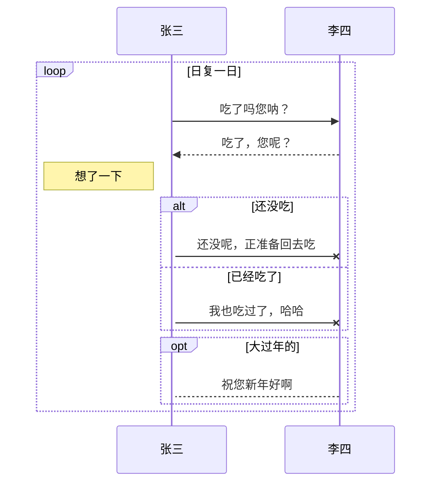

----

# 一些例子

https://mermaid.js.org/intro/


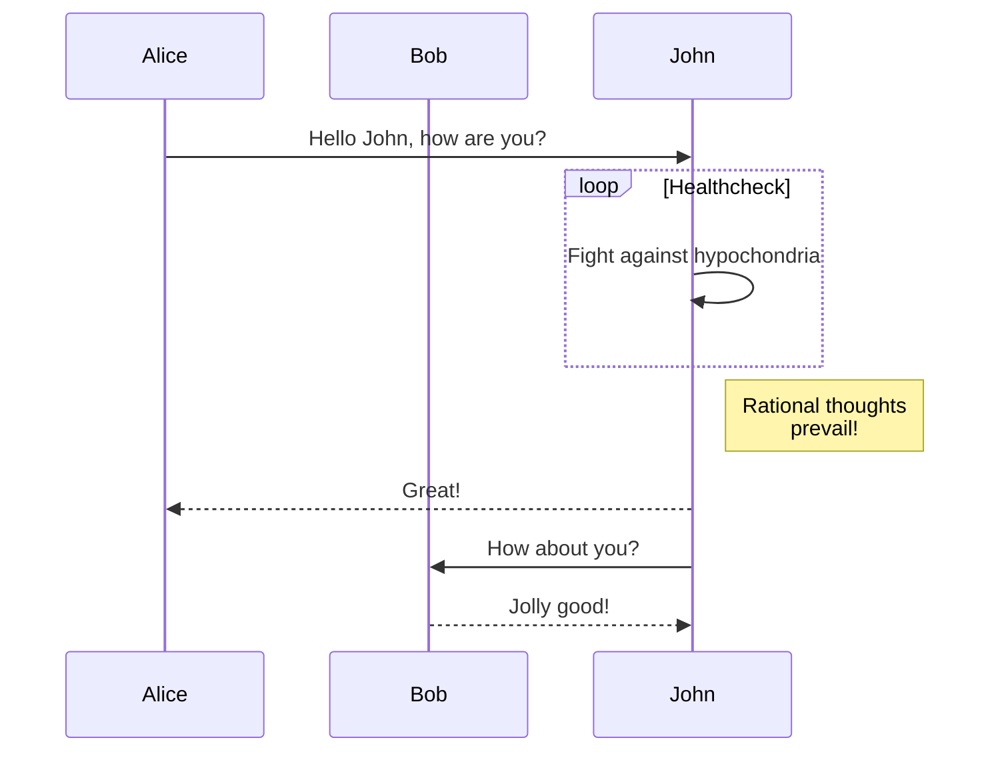

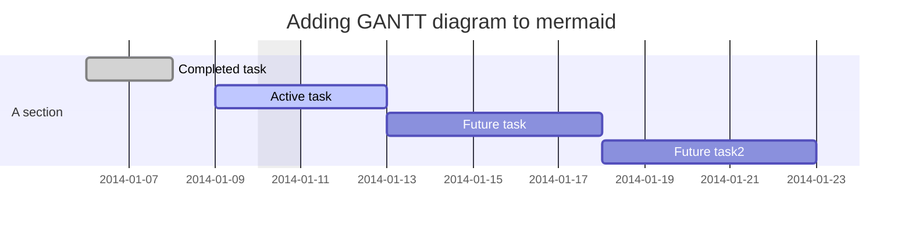

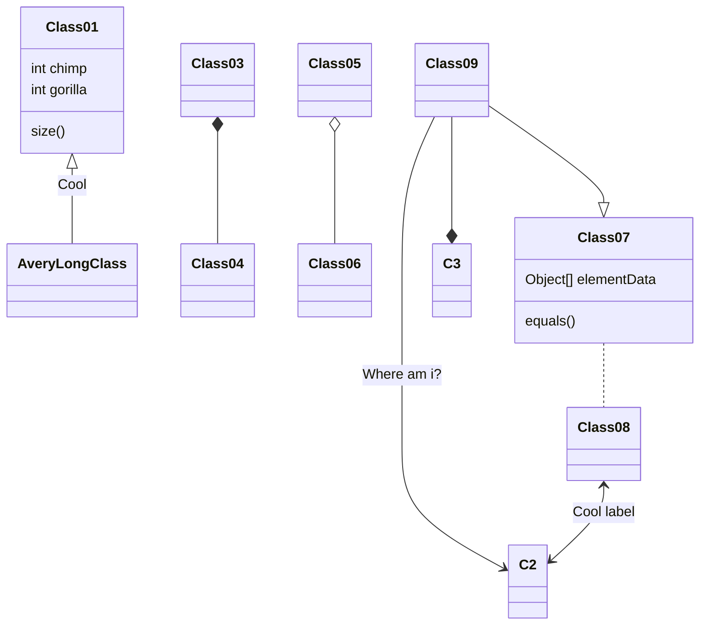


## 有CSS修饰的class

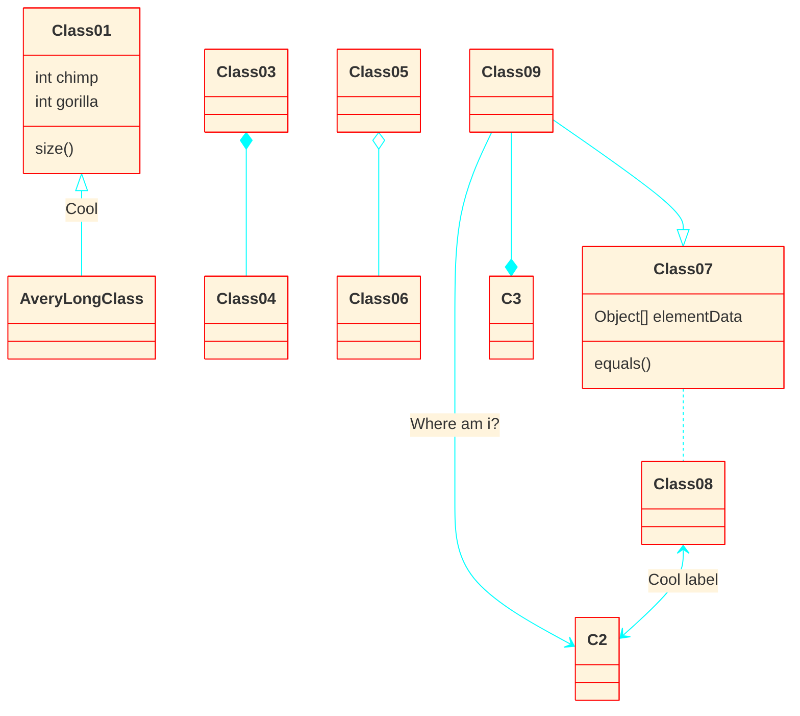

类图的主要样式是使用预设数量的 css 类完成的。在渲染期间，这些类是从位于 src/themes/class.scss 的文件中提取的。此处使用的类如下所述：

class| 描述
| :-----| ----: | 
|g.classGroup 文本|	一般类文本的样式|
类组 .title|	一般类标题的样式|
|g.classGroup 矩形|	类图矩形的样式|
|g.classGroup 行|	类图线的样式|
|.classLabel .box|	类标签框的样式|
|.classLabel .标签	|类标签文本的样式|
|作品|	组合箭头和箭头线的样式|
|聚合|	聚合箭头和箭头线的样式（虚线或实线）|
|依赖|	依赖箭头和箭头线的样式|


示例
```
body {
    background: white;
}

g.classGroup text {
    fill: $nodeBorder;
    stroke: none;
    font-family: 'trebuchet ms', verdana, arial;
    font-family: var(--mermaid-font-family);
    font-size: 10px;

    .title {
        font-weight: bolder;
    }
}

g.classGroup rect {
    fill: $nodeBkg;
    stroke: $nodeBorder;
}

g.classGroup line {
    stroke: $nodeBorder;
    stroke-width: 1;
}

.classLabel .box {
    stroke: none;
    stroke-width: 0;
    fill: $nodeBkg;
    opacity: 0.5;
}

.classLabel .label {
    fill: $nodeBorder;
    font-size: 10px;
}

.relation {
    stroke: $nodeBorder;
    stroke-width: 1;
    fill: none;
}

@mixin composition {
    fill: $nodeBorder;
    stroke: $nodeBorder;
    stroke-width: 1;
}

#compositionStart {
    @include composition;
}

#compositionEnd {
    @include composition;
}

@mixin aggregation {
    fill: $nodeBkg;
    stroke: $nodeBorder;
    stroke-width: 1;
}

#aggregationStart {
    @include aggregation;
}

#aggregationEnd {
    @include aggregation;
}

#dependencyStart {
    @include composition;
}

#dependencyEnd {
    @include composition;
}

#extensionStart {
    @include composition;
}

#extensionEnd {
    @include composition;
}
```

```
<style>
  .conceal {

    opacity: 20% !important;
 
  }
  .edgePaths:has(~g>g.conceal) {
    opacity: 20% !important;
  }
</style>

```
<style>
    body {
  background: white;
}

  .conceal {
    fill: #00ff00 !important;
    stroke: #ffff00 !important;
    stroke-width: 4px !important;
  }

</style>


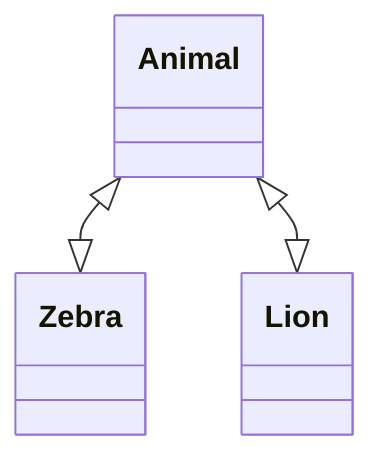


-------

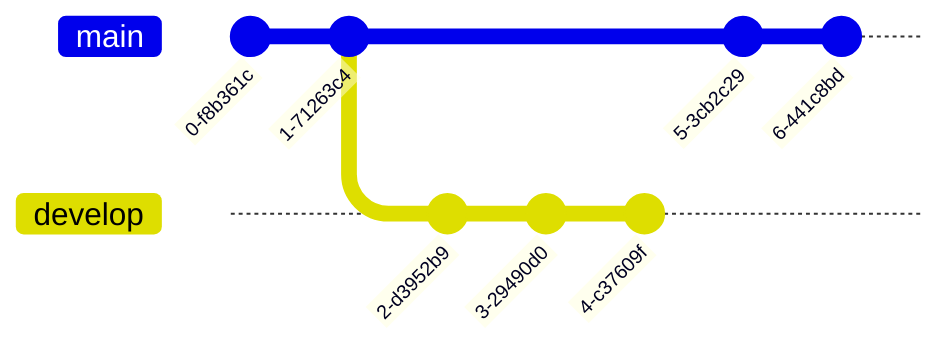

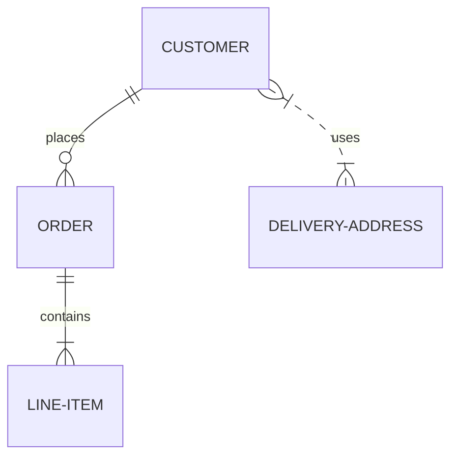

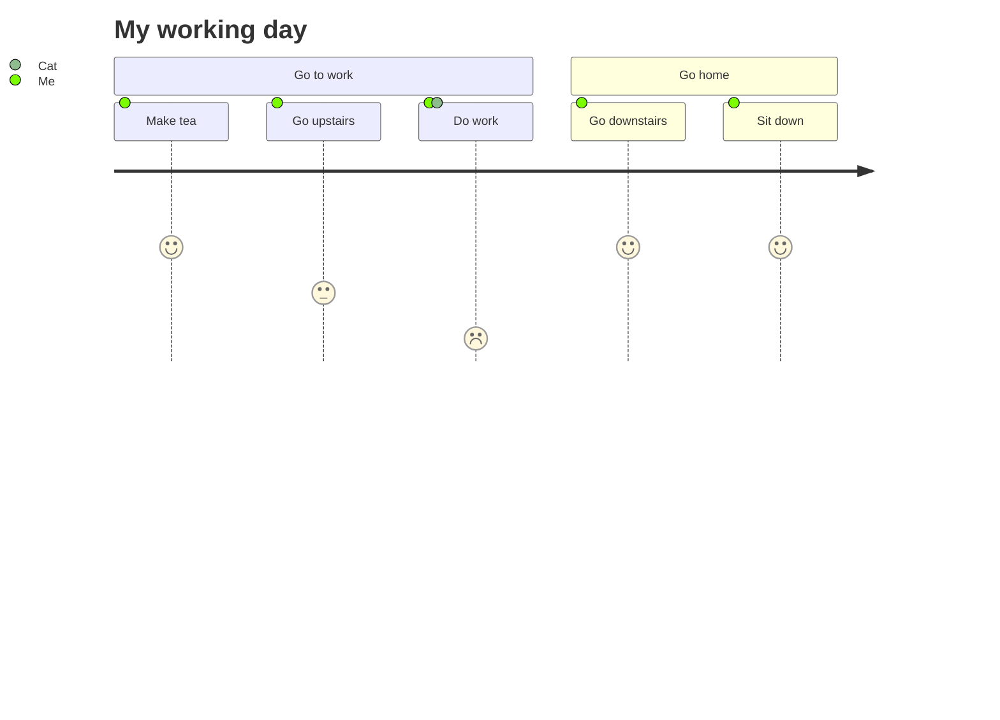

``` 
quadrantChart
    title Reach and engagement of campaigns
    x-axis Low Reach --> High Reach
    y-axis Low Engagement --> High Engagement
    quadrant-1 We should expand
    quadrant-2 Need to promote
    quadrant-3 Re-evaluate
    quadrant-4 May be improved
    Campaign A: [0.3, 0.6]
    Campaign B: [0.45, 0.23]
    Campaign C: [0.57, 0.69]
    Campaign D: [0.78, 0.34]
    Campaign E: [0.40, 0.34]
    Campaign F: [0.35, 0.78]
```
