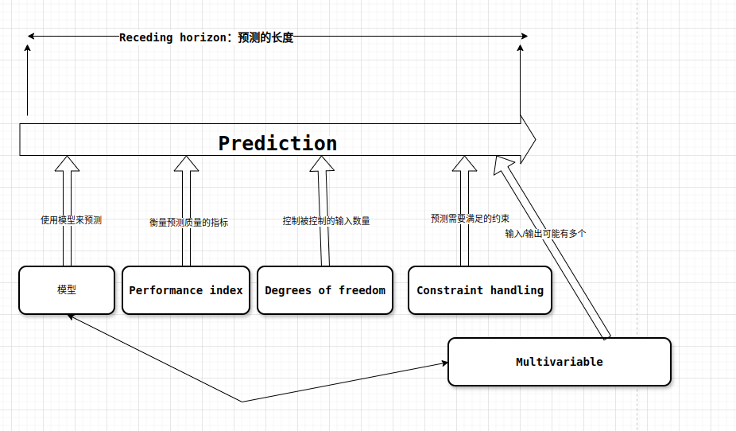

# 1. Prediction
 
# 2. Receding horizon

# 3. Modelling
# 4. Performance index

**Performance index**是用数值的形式来衡量预测得好不好

In order to automate a predictive control strategy, that is to decide which input trajectory is best, one needs a precise numeric definition of ‘best’.
The performance index is a numeric definition for best.

# 5. Degrees of freedom
# 6. Constraint handling
# 7. Multivariable

-----

>PID 是有滞后行为，只能等待需要修正的情况出现了，才进行调整。而MPC则是可以对未来提前预测，避免滞后的行为

>现在计算能力比较强，可以对系统进行划分成多节，然后对一整节进行Receding horizon。这样的长度可以覆盖整个状态，从而有比较好的效果，典型的例子就是DCM预测摆动腿的实现。

> Performance index很经常采用二次式，因为二次式是convex，有全局唯一的最小点。不过根据Byod的说法来说，凡是convex的都有全局最小点，即使不是convex,是quasi-convex，在一段区间内也是有最小点的

>建模和实际的物理模型，普遍存在偏差，在10%-20%之间，一味地追求高精度建模有时不能带来同比例的收益。微小的模型误差，可以通过快速的输入调整来修正.

>个人观点：**数据的准确性十分重要，这个可能是 sim和real的最大的gap**
