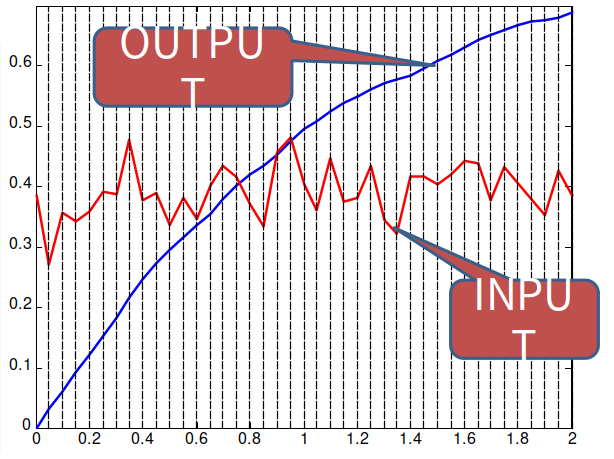
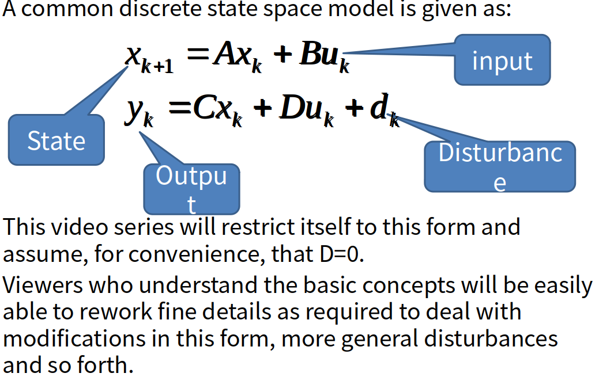
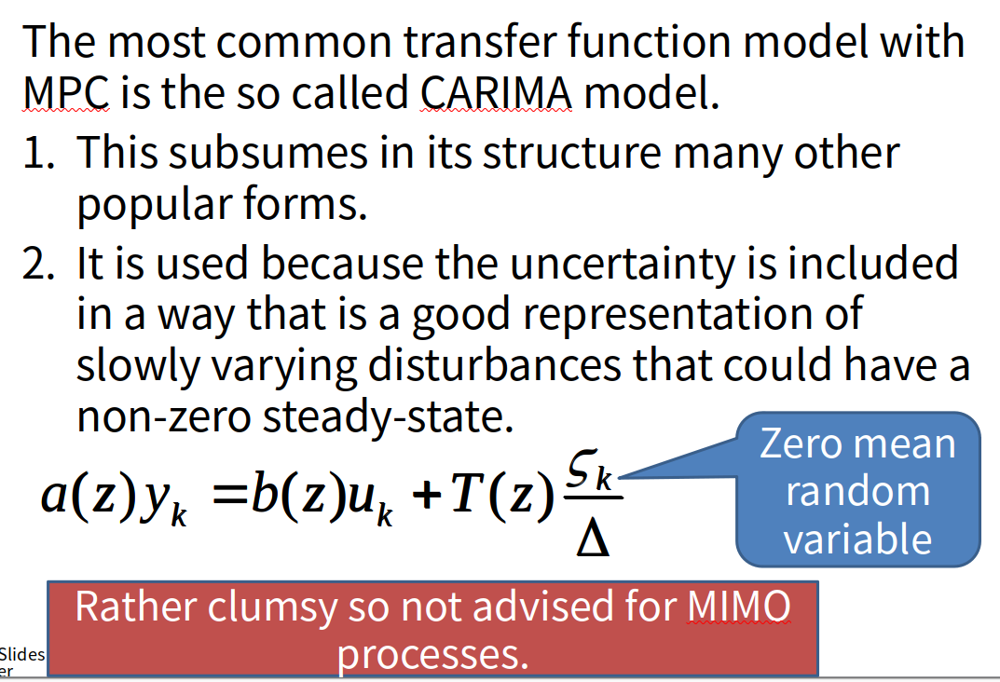
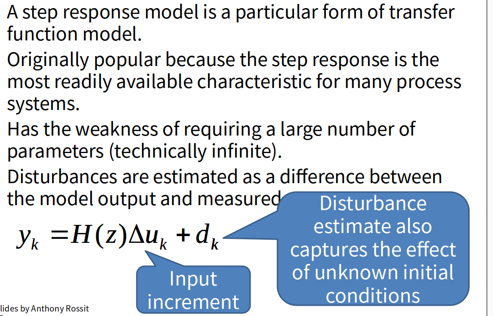
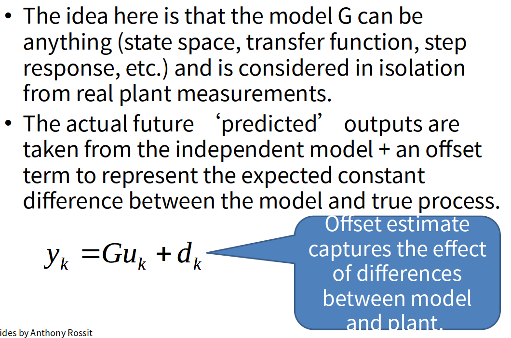

[toc]

# sample rate

Several different issues govern the best choice of sample rate.
A typical argument is that one wants around 10 sample points within a typical response (settling time or rise time?)

采样率不能太低，不然无法快速响应当前的实际情况

Let the input change very frequently, here at about 100 times the rise time.
The inherent ‘lag’ (small high freq. gain) within a real system will not respond to these high frequency changes!

采样率太快也不行，实际系统无法响应过高的控制频率

Using a high sample rate is pointless:
The system cannot respond to fast input changes.
It increases the number of decision variables, which implies a more challenging optimisation.

# State space models

# Transfer function models

# Step response models

# Independent model

# Summary

It is common to use discrete models in predictive control.
These models can take whatever form the user wants, but the algorithm is much easier to code and implement if simple linear models are used.
**A typical sample rate will be about 1/10 of the timescale of the principle dynamics. Again this can be modified if necessary, but much faster or slower would normally be nonsensical**
