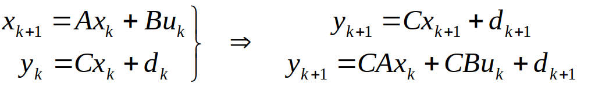

[toc]

# State space models

# Basic concepts of prediction

Discrete models are one-step ahead prediction models, that is, given data at sample ‘k’, one can determine data at sample ‘k+1'

Normally one would assume  that the best guess gives:`d_k+1=d_k`,即噪音保持不变

# Basic concepts of prediction MPC预测公式的递推

A general expression of the n-step ahead prediction is given as:

The system output can be determined simply using:

>HOWEVER: This prediction mixes up past and future data, so it is advisable to be more careful with notation and construction of the predictions. 

# Prediction notation 预测中的一些符号
A common notation in the literature uses a `double subscript` – the `first term determines the sample of the prediction` (how many steps ahead) and the` 2nd denotes the sample at which the prediction was made` (only used for prediction and not past).

Example

# Predictions with notation 对上面的MPC递推公式的符号进行重组

A general expression of the n-step ahead prediction is given as:

The double subscript makes it clear where a value is notionally `in the future or a predicted value` as opposed to known.

>Double subscripts are used for clarity where needed. 
However, these may be avoided where they are considered obvious from the context.

# Splitting predictions 对公式进行进一步的分割处理
It is convenient to separate predictions into the part which is known and the part which is yet to be determined.

>The aim will be to choose the `unknown` inputs to ensure that the overall prediction is satisfactory. 

# Summary

It is common to use discrete models for prediction.
This video has shown how state space models can be used to form n-step ahead predictions.
It is also shown how predictions can be separated into known parts (based on measurements) and unknown parts (based on decision variables yet to be selected).
There was an implicit assumption that the state is known whereas in practice one may need an observer for this.
